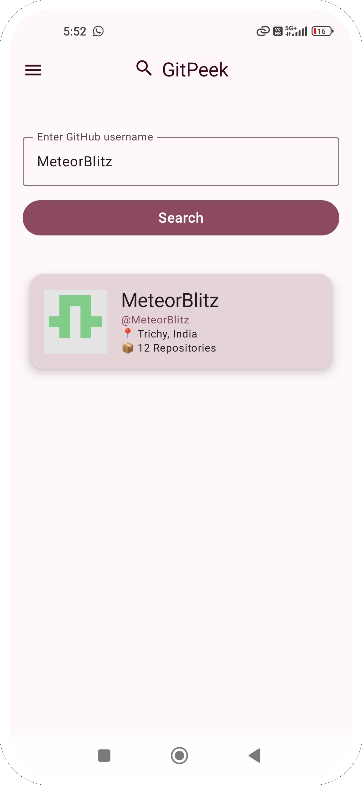
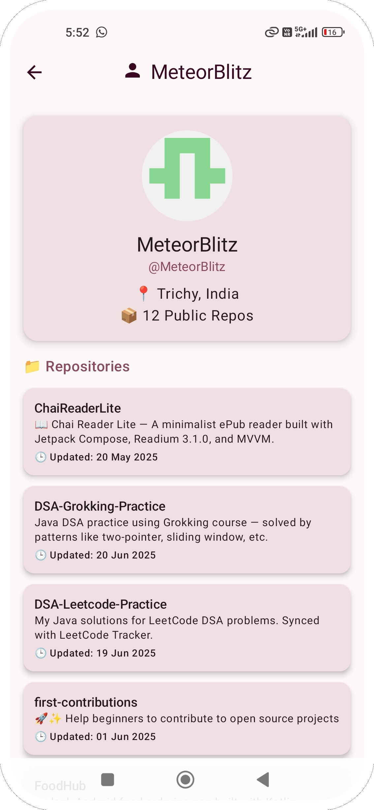

# 📱 GitPeek

GitPeek is a modern Android app built using **Jetpack Compose** and **MVI Architecture**, allowing users to search and view GitHub user details and repositories.

---

## ✨ Features

- 🔍 Search GitHub users by username
- 👤 View user profile with avatar, name, location, and repo count
- 📁 List of public repositories with last updated info
- 💬 Error handling and retry option
- ⚙️ Built with modern Android libraries


---

## 🛠️ Built With

- 🧱 Jetpack Compose
- 🧠 MVI Architecture (Unidirectional Data Flow)
- 🌐 Retrofit (GitHub API)
- 🧪 Hilt for Dependency Injection
- 💾 Kotlin Coroutines + Flow
- 🎨 Material 3 Design

---

## 📸 Screenshots

<table>
  <tr>
    <td></td>
    <td></td>
  </tr>
  <tr>
    <td align="center"><strong>Home Screen</strong></td>
    <td align="center"><strong>Detail Screen</strong></td>
  </tr>
</table>


---

## 🚀 Getting Started

1. Clone the repo  
   ```bash
   git clone https://github.com/your-username/GitPeek.git
